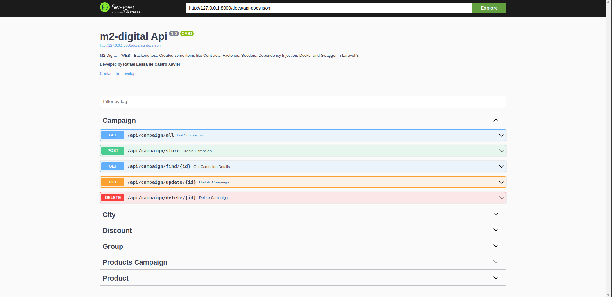

## About

M2 Digital - WEB - Backend test. Created some items like Contracts, Factories, Seeders, Dependency Injection, Docker and Swagger in Laravel 8.

## Solution

Made using the Laravel 8 framework, MySQL database, Docker for application containerization and Swagger for APIS visualization and testing.



## How to run the project

After downloading the **m2-digital** repository, being in its main folder, go up the structure composed of the following containers:

- **api-m2-back:** Composed with Apache and PHP, being exposed to port `8000`;
- **api-m2-db:** With the MySql database.

1) Create the .env file from the .env.example file contained in the project root:
```sh
  cp .env.example .env
```
2) Through the following commands:
```sh 
docker-compose build
```
```sh 
docker-compose up -d
```

After finishing the creation of the containers, we must execute the commands below so that the environment is ready to be used:

1. Used to populate the database with the necessary tables of the solution:
   ```sh 
   docker exec -ti api-m2-back php artisan migrate
   ```
2. Used to populate the tables if you want to view pre-registered data(Optional):
   ```sh 
   docker exec -it  api-m2-back php artisan db:seed
   ```
3. Used to permissions config(<strong>Required).
   ```sh 
   docker exec -it  api-m2-back chown -R www-data:www-data storage/
   ```
   
Now we can use the application through the address "http://127.0.0.1:8000/api/documentation"
If you want to run the application later, check if the `api-m2-back` container is active
executing the following command (Remembering that the same can/must be applied to the container
from the database):

```sh
docker container ls -a
```
If you want to start the `api-m2-back` container, run the following command:
```sh
docker container start api-m2-back
```
If you want to stop the `api-m2-back` container, run the following command:
```sh
docker container stop api-m2-back
```
